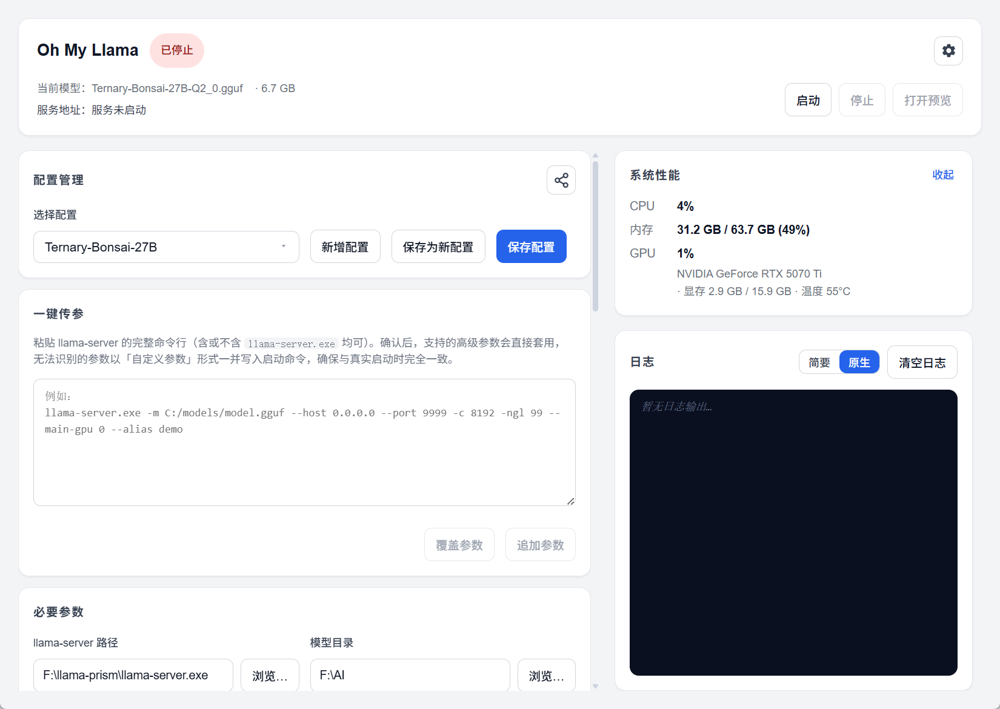

# Oh My Llama

**中文** | [English](README_En.md)

> 让 `llama-server` 的启动与参数管理变得简单。

Oh My Llama 是一款桌面工具，用于集中管理 `llama-server` 的启动配置、参数和日志。支持多配置切换、一键解析命令行、一键分享参数，以及实时进程控制，帮助你告别手拼命令行的痛苦。

---



## ✨ 核心亮点

### 多配置切换

支持多配置切换，不用再在笔记本中翻找你那一堆参数配置了——这里统一管理。可新增、重命名、删除与保存。


### 一键传参

看累了各种 llama-serve-launcher 自以为是的把所有参数分成独立输入框而头大？这里支持你把所有参数一键粘贴，Oh My Llama 帮你解析——已知参数归位、识别启动器路径，不认识的参数也原样保留为自定义参数。

### 配置分享

Oops，你调出了非常棒的参数，想立刻分享给社区好友，Oh My Llama 碰巧支持你一键复制所有启动参数——这是一个正循环。复制出的命令行与后端启动逻辑完全一致，对方粘过去就能跑。

---

## 🚀 快速开始

### 下载

前往 [GitHub Releases](https://github.com/GDWhisper/oh-my-llama/releases) 下载最新安装包。

---


## ⚙️ 配置存储

所有配置持久化在以下位置：

```
%APPDATA%/OhMyLlama/configs.toml
```

其中 `%APPDATA%` 通常为：

```
C:\Users\<用户名>\AppData\Roaming
```

配置文件采用 TOML 格式，包含默认配置和所有命名配置。

---

## 🛠️ 技术栈

| 层 | 技术 |
|---|---|
| 框架 | [Tauri 2](https://tauri.app/) |
| 前端 | React 19 + TypeScript + Vite |
| 后端 | Rust |
| 配置格式 | TOML |
| 进程管理 | 原生进程管理（含 Job Object 兜底） |

---

## 🤝 贡献

欢迎以任何方式参与本项目，优先通过 [Issues](https://github.com/GDWhisper/oh-my-llama/issues) 提出需求或反馈问题，也欢迎提交 PR。

### 开发环境

**环境要求：**

- Node.js >= 18
- Rust >= 1.75（通过 [rustup](https://rustup.rs/) 安装）
- Tauri CLI：`cargo install tauri-cli`

### 本地开发

```bash
# 安装依赖
npm install

# 启动开发服务器（前端端口 6060）
npm run tauri dev
```

### 验证与构建

```bash
# 前端类型检查 + lint
npm run check:frontend

# 后端测试
cargo test --lib --manifest-path src-tauri/Cargo.toml

# 全量检查（前端 + 后端）
npm run check

# 构建
npm run tauri build
```

---

## 📄 License

[FSL-1.1-MIT](license.md)